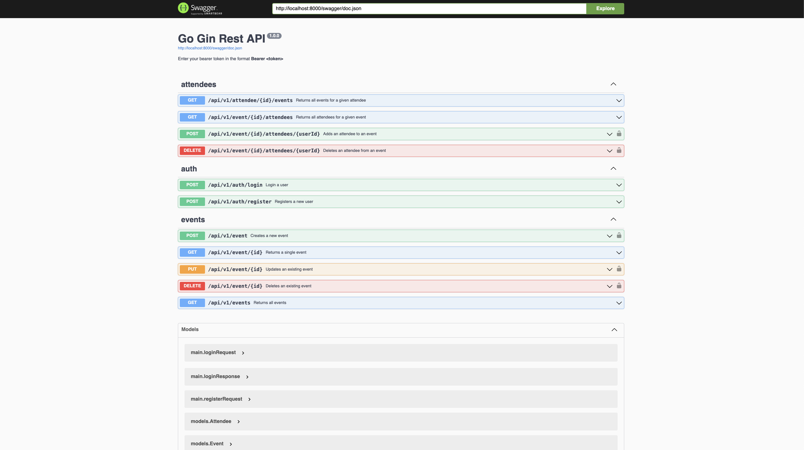

# 📅 Event API

A RESTful API built with **Golang** and **Gin** for managing events and attendees. This project demonstrates proper RESTful architecture, user authentication, and attendee-event association.

## 🚀 Features

-   ✅ User registration & login with JWT authentication
-   📅 Full CRUD operations for events
-   👥 Event-attendee relationship management
-   🔐 Protected routes with bearer token
-   📄 Auto-generated Swagger docs
-   🔄 Live-reloading for development using [Air](https://github.com/cosmtrek/air)

## 🧾 API Endpoints

### 🔐 Auth

| Method | Endpoint                | Description         |
| ------ | ----------------------- | ------------------- |
| POST   | `/api/v1/auth/login`    | Login a user        |
| POST   | `/api/v1/auth/register` | Register a new user |

### 📅 Events

| Method | Endpoint             | Description              |
| ------ | -------------------- | ------------------------ |
| POST   | `/api/v1/event`      | Create a new event       |
| GET    | `/api/v1/event/{id}` | Get a specific event     |
| PUT    | `/api/v1/event/{id}` | Update an existing event |
| DELETE | `/api/v1/event/{id}` | Delete an event          |
| GET    | `/api/v1/events`     | List all events          |

### 👥 Attendees

| Method | Endpoint                                | Description                   |
| ------ | --------------------------------------- | ----------------------------- |
| GET    | `/api/v1/attendee/{id}/events`          | Get events attended by a user |
| GET    | `/api/v1/event/{id}/attendees`          | Get attendees of an event     |
| POST   | `/api/v1/event/{id}/attendees/{userId}` | Add user to an event          |
| DELETE | `/api/v1/event/{id}/attendees/{userId}` | Remove user from an event     |

## 🧱 Models

Models exposed in the Swagger UI:

-   `User`
-   `Event`
-   `Attendee`

## 🛠 Project Structure

```bash
event-api/
├── assets/                 # Static assets (e.g., images)
├── cmd/api/                 # Entry point for the API
├── docs/                    # Swagger documentation
├── internal/                # Core business logic
├── migrate/                 # DB migrations
├── tmp/                     # Temp files
├── .air.toml                # Live reload config
├── .env.example             # Sample environment variables
├── data.db                  # SQLite DB file
├── go.mod / go.sum          # Go module dependencies
```

## ⚙️ Getting Started

### Prerequisites

-   Go ≥ 1.16
-   [Air](https://github.com/cosmtrek/air) for development
-   SQLite (optional if you use embedded `data.db`)

### Installation

```bash
git clone https://github.com/rajan-marasini/event-api.git
cd event-api
cp .env.example .env
go mod tidy
```

### Run Migrations (if applicable)

```bash
go run migrate/main.go up
```

### Run the Server

#### For development

```bash
air
```

#### Or run manually

```
go run cmd/api/main.go
```

## 🧪 Testing the API

Visit: [http://localhost:8000/swagger/index.html](http://localhost:8000/swagger/index.html)

The Swagger UI provides a complete interactive documentation where you can test endpoints.


## Contributing

Contributions are welcome! Please open an issue or submit a pull request for any enhancements or bug fixes.
